> Portfolio Project
>
> Production-style Azure AI Platform demonstrating secure cloud-native application deployment using Azure Container Apps, Cosmos DB, Key Vault, Managed Identity, and Azure Monitoring.

# Azure AI Platform Engineering Lab


## Executive Summary

This project demonstrates the deployment of a secure cloud-native AI platform on Microsoft Azure.

The platform leverages Azure Container Apps for application hosting, Azure Container Registry for image management, Azure Key Vault for secret storage, Azure Cosmos DB for scalable NoSQL data persistence, Managed Identity for credential-free authentication, and Log Analytics for operational monitoring.

The solution follows Azure Well-Architected Framework principles emphasizing:

- Security
- Reliability
- Operational Excellence
- Cost Optimization
- Performance Efficiency

## Overview

This project demonstrates the design and deployment of an Azure AI platform using modern cloud-native services.

The lab covers:

- Azure Container Registry (ACR)
- Azure Container Apps
- Azure Kubernetes Service (AKS)
- Azure Cosmos DB Vector Search
- PostgreSQL pgvector
- Azure Managed Redis
- Azure Service Bus
- Azure Event Grid
- Azure Functions
- Azure Key Vault
- Managed Identities
- OpenTelemetry
- Azure Monitor


## Azure Container Registry

An Azure Container Registry (ACR) instance was deployed to provide a private container image repository for Container Apps and Azure Kubernetes Service (AKS).

### Configuration

- SKU: Basic
- Authentication: Azure AD
- Purpose: Container image storage and distribution


## Phase 3 – Azure Container Apps

### Objective

Deploy a containerized application using Azure Container Apps and validate external HTTP access.

### Components Deployed

- Azure Container Apps Environment
- Azure Container App
- Log Analytics Workspace
- External HTTP Ingress

### Configuration

| Setting | Value |
|----------|--------|
| Region | East US |
| Workload Profile | Consumption |
| CPU | 0.25 |
| Memory | 0.5 Gi |
| Ingress | Enabled |
| Target Port | 80 |

### Validation

The application was successfully deployed and exposed through a public HTTPS endpoint.

**Application URL Validation**

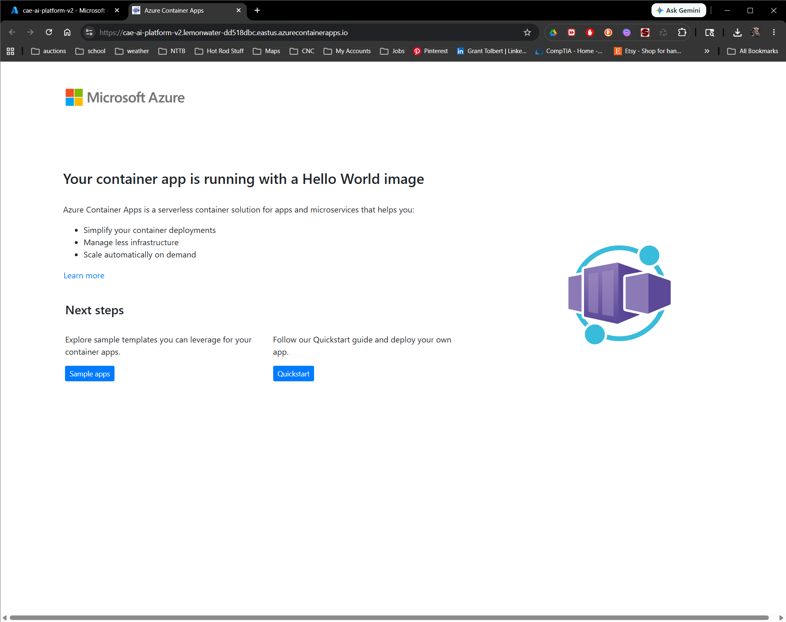

### Troubleshooting Encountered

During deployment, the initial Container Apps Environment entered a `ScheduledForDelete` state which prevented new application deployments.

Resolution:

- Created replacement environment `cae-ai-platform-v2`
- Redeployed application
- Verified successful application availability

## Solution Architecture

The platform consists of multiple Azure services working together to provide a secure and scalable AI application foundation.

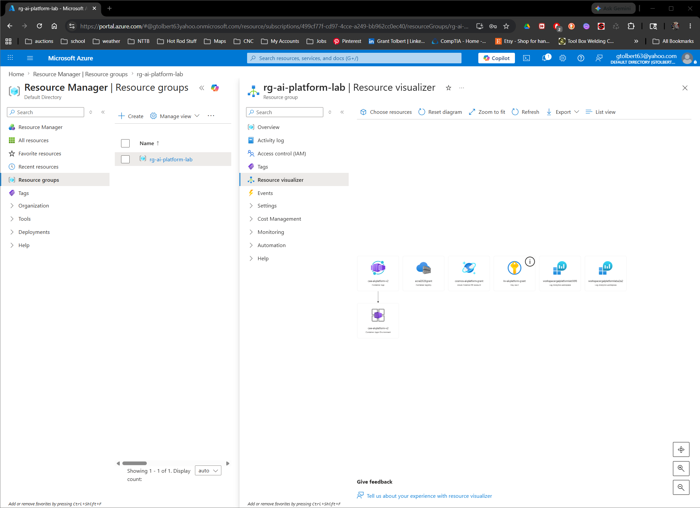

### Architecture Components

| Service | Purpose |
|----------|----------|
| Azure Container Apps | Application Hosting |
| Azure Container Registry | Container Image Storage |
| Azure Key Vault | Secret Management |
| Azure Cosmos DB | Data Storage |
| Managed Identity | Authentication |
| Log Analytics | Monitoring |
| Resource Group | Resource Organization |


### Skills Demonstrated

- Azure Container Apps
- Serverless Containers
- Application Ingress
- Azure Monitoring Integration
- Deployment Troubleshooting
## Phase 4 – Managed Identity and Azure Key Vault

### Objective

Implement secure secret management using Azure Key Vault and System Assigned Managed Identity.

### Architecture

```text
Container App
      │
Managed Identity
      │
RBAC Authorization
      │
Azure Key Vault
      │
Application Secrets
```

### Managed Identity Configuration

System Assigned Managed Identity was enabled on the Azure Container App.

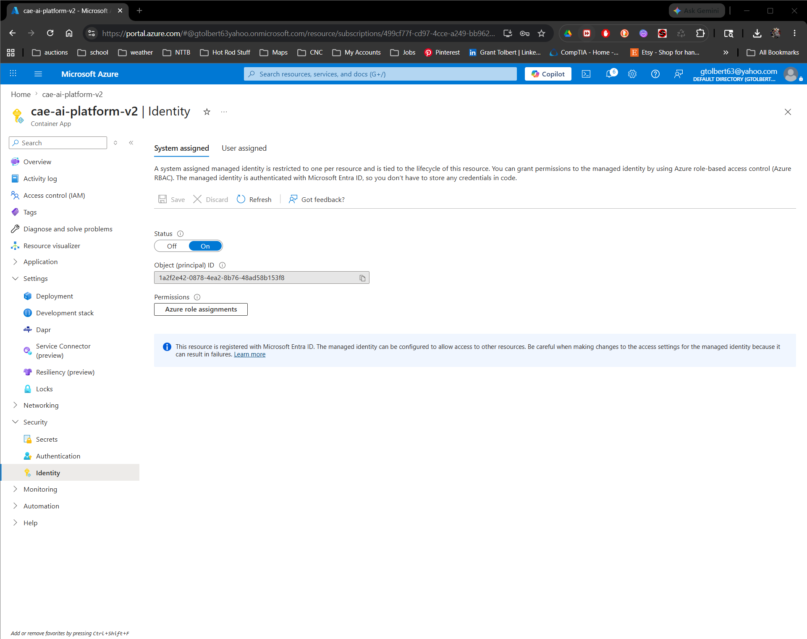

### Azure Key Vault

Created:

- kv-ai-platform-grant

Stored Secrets:

- openai-api-key
- cosmos-connection-string

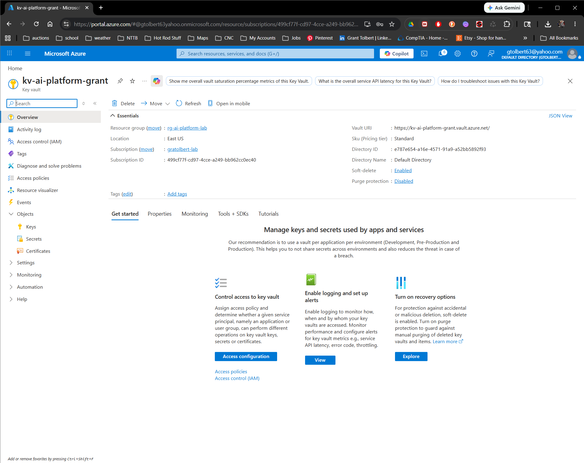

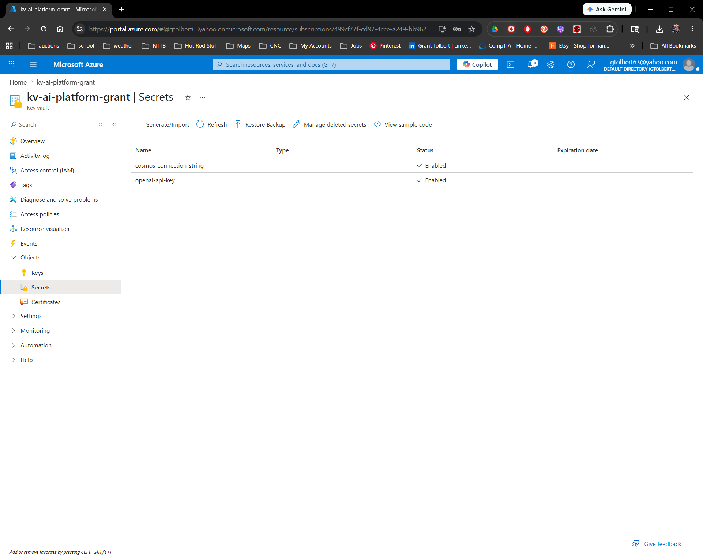

### RBAC Authorization

Assigned:

| Role | Principal |
|--------|-----------|
| Key Vault Secrets User | cae-ai-platform-v2 |

This allows the application to securely retrieve secrets without storing credentials in code.

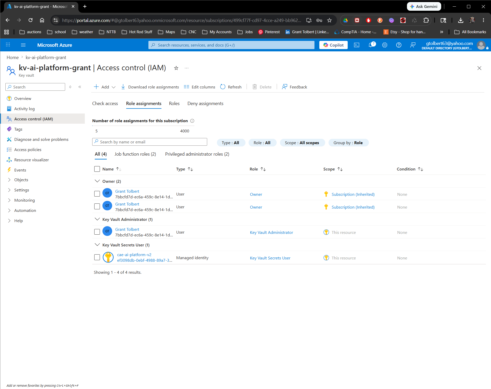

### Security Benefits

- No hardcoded secrets
- Managed Identity authentication
- Role-Based Access Control (RBAC)
- Centralized secret management
- Production-ready Azure security pattern

## Phase 5 – Azure Cosmos DB

### Objective

Deploy a globally distributed NoSQL database to support AI application data storage and retrieval.

### Components Created

- Cosmos DB Account
- SQL Database
- Container
- Connection String Secret
- Key Vault Integration

### Configuration

| Setting | Value |
|----------|----------|
| API | NoSQL |
| Capacity Mode | Serverless |
| Region | East US |
| Backup Policy | Periodic |
| Authentication | Key-Based |

### Database Creation

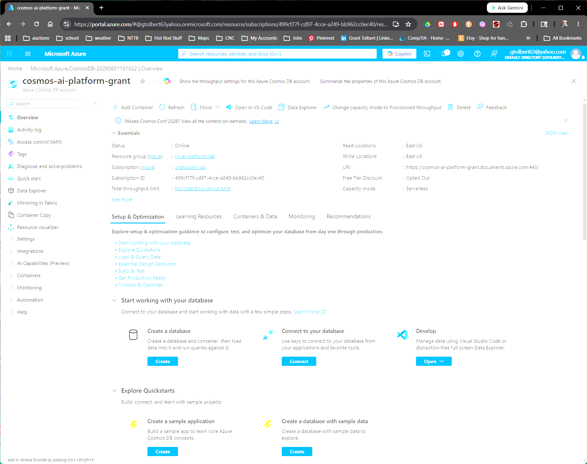

### Database

Database Name:

ai-platform-db

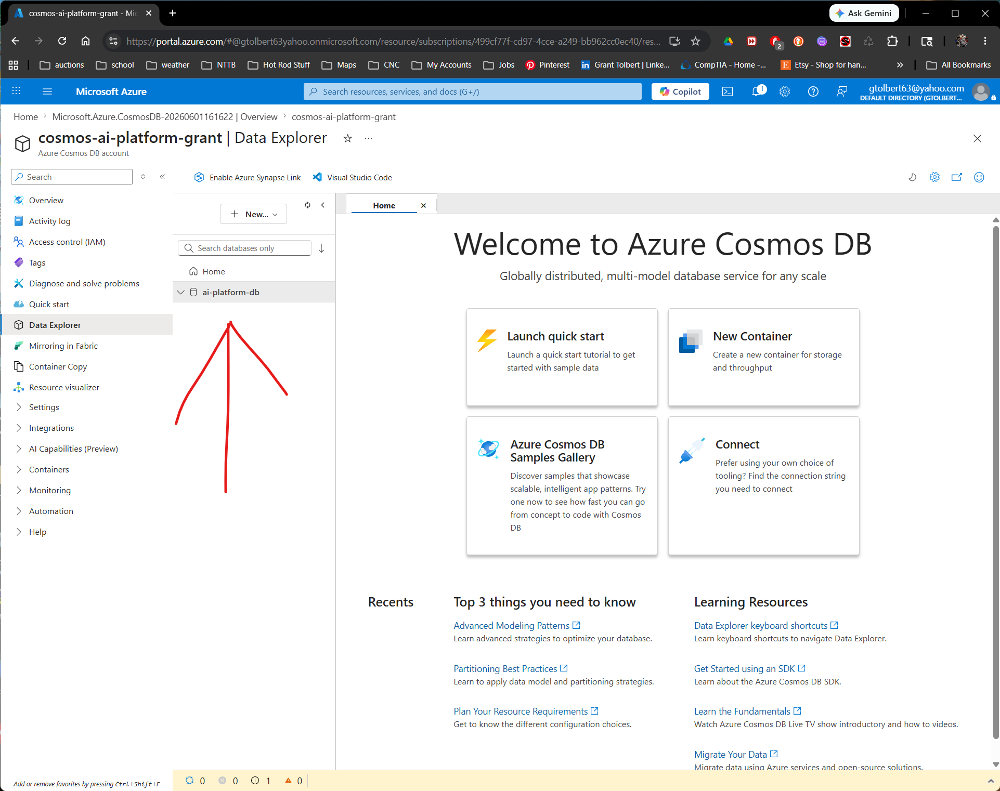

### Container

Container Name:

chat-history

Partition Key:

/partitionKey

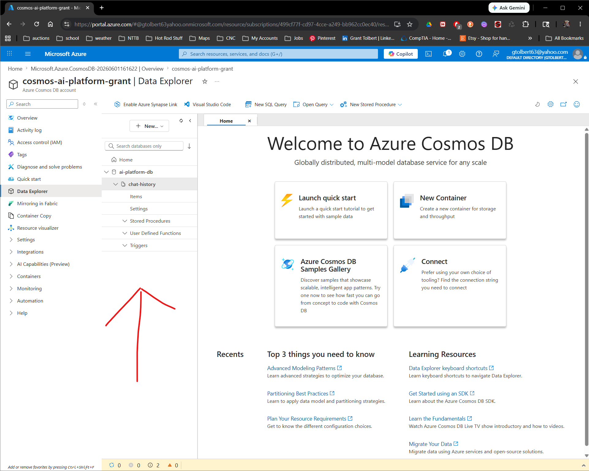

### Secure Secret Storage

Cosmos DB connection strings were stored securely in Azure Key Vault.

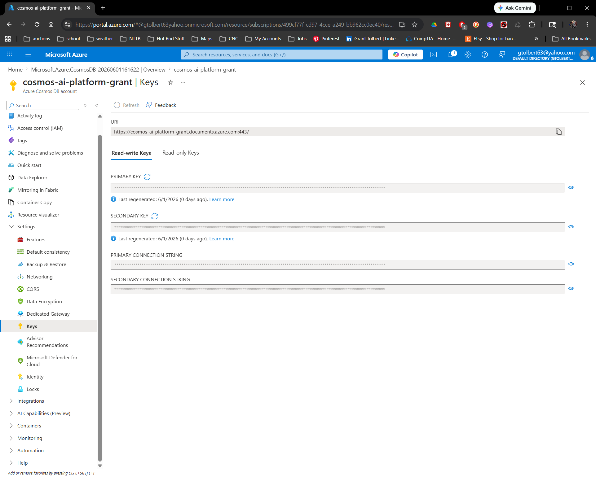

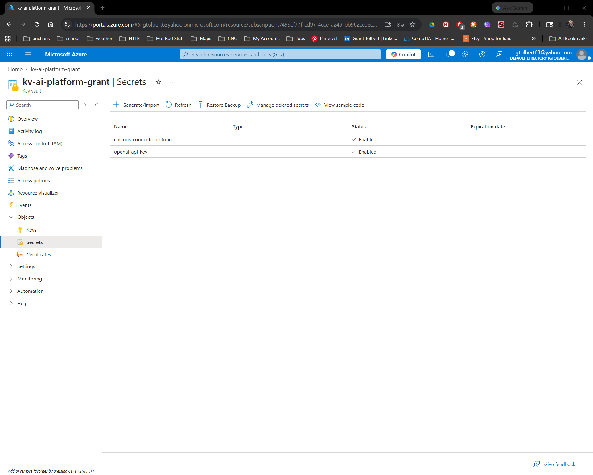

## Security Architecture

The platform implements a Zero Trust security model.

### Security Controls

- Managed Identity Authentication
- Azure RBAC Authorization
- Key Vault Secret Storage
- No Hardcoded Credentials
- Encrypted Communications
- Azure AD Integration

### Authentication Flow

Container App
↓
Managed Identity
↓
Azure RBAC
↓
Azure Key Vault
↓
Cosmos DB Credentials

### Benefits

- Eliminates credential sprawl
- Reduces attack surface
- Supports enterprise compliance
- Enables secret rotation

## Skills Demonstrated

### Cloud Platforms

- Microsoft Azure

### Compute

- Azure Container Apps
- Containerized Applications

### Containers

- Docker
- Azure Container Registry

### Security

- Azure Key Vault
- Managed Identity
- RBAC
- Secret Management

### Databases

- Azure Cosmos DB
- NoSQL

### Monitoring

- Log Analytics
- Azure Monitoring

### DevOps

- Git
- GitHub
- CI/CD Concepts

### Architecture

- Cloud Architecture Design
- Resource Visualization
- Production Deployments

- Azure Cosmos DB
- NoSQL Database Design
- Serverless Databases
- Secure Secret Management
- Cloud Data Architecture
- Azure Key Vault
- Managed Identity
- RBAC
- Zero-Trust Security
- Secretless Authentication